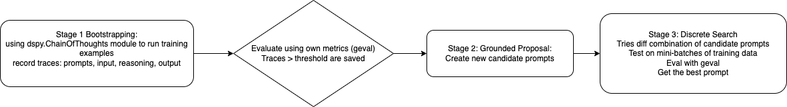

# Prompt Optimization (Playground)
* This repository is a playground frameworks and techniques for auto prompt optimization

## **DSPy experiments**
* Using 7 synthetic conversation from a course inquiry chatbot use case. 
* Managed to include multi-turn conversation into the DSPy Example, which is their default dataset container
* Using GEval evaluation metrics, self defined. 
* Using the built-in MIPROv2 optimizer
* The optimizer is assuming required information (e.g. age and interest of the kid for a course inquiry chatbot) is already available. It only optimize the final output. 
* Here is the optimized prompt:
```text
"instructions": "Imagine a parent is seeking advice on the best educational programs for their
      child who is struggling with math and is also interested in robotics. The conversation has
      already established the child's age and current skill level in math. Your task is to continue
      the conversation by generating a thoughtful and informative assistant response, taking into
      account the child's needs and interests. Make sure to provide specific program recommendations,
      including details about the curriculum, schedule, and how it can help improve their math skills
      while engaging their interest in robotics.",
```

* Next: to check if there a DSPy optimizer for optimizing exisitng prompt 


## **How DSPy MIPROv2 optimizer works**
